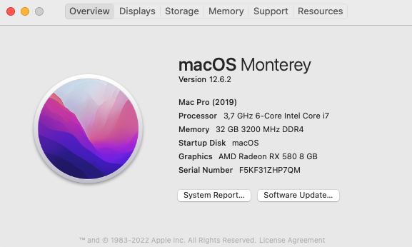

# z390-aorus-master-opencore

## My Hardware
- Gigabyte Z390 Aorus Master (Bios version: F11)
- Intel i7-8700K (8) @ 3.70GHz (Coffee Lake)
- 32GB Corsair LPX (2x16GB) DDR4 3200
- 1 x MQUPIN Fenvi T919 Desktop Wireless WiFi Adapter for macOS (BCM94360CD)
- 1 x Samsung SSD 980 PRO 1TB
- 1 x Samsung SSD 980 PRO 500GB
- 2 x WDC WD20EFRX-68AX9N0 2TB
- 1 x Radeon™ RX580

