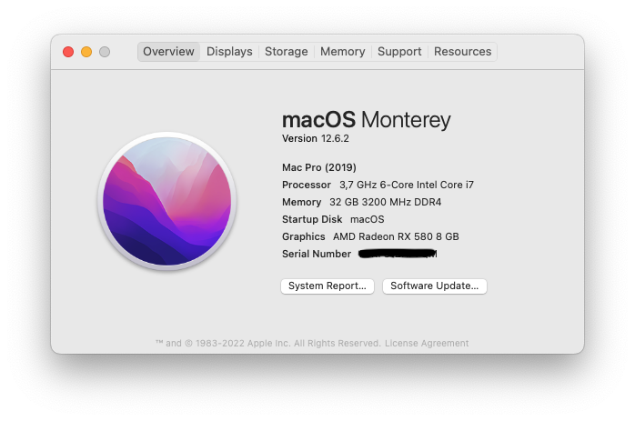

# z390-aorus-master-opencore

## My Hardware
- Gigabyte Z390 Aorus Master (Bios version: F11c)
- Intel i7-9700K (8) @ 3.60GHz (Coffee Lake)
- 32GB Corsair CMW32GX4M2C3200C16 Vengeance RGB PRO 32GB (2x16GB) DDR4 3200
- 1 x MQUPIN Fenvi T919 Desktop Wireless WiFi Adapter for macOS (BCM94360CD)
- 1 x XPG SX8200 Pro 1TB 3D NAND NVMe (Windows 11)
- 1 x Samsung 980 Series 1TB PCIe Gen3. X4 NVMe (macOS Monterey)
- 1 x Seagate 4TB Backup HDD
- 1 x Radeon™ RX VEGA 56 GAMING OC 8G — Slot #1
- 1 x ROG-STRIX-RTX 3080-O10G-GAMING ([Disabled in 
macOS](https://github.com/joelthecoder/z390-aorus-master-opencore/commit/120f6618d19da87f12fd94ad9dd03d9637bc2dc6)) — Slot #2

[Using OpenCore v0.7.6](https://github.com/acidanthera/OpenCorePkg/releases/tag/0.7.6)

## Guide
- [Dortania OpenCore Installation Guide](https://dortania.github.io/OpenCore-Install-Guide/)
  - [Coffee Lake](https://dortania.github.io/OpenCore-Install-Guide/config.plist/coffee-lake.html)
  - [Making the Installer](https://dortania.github.io/OpenCore-Install-Guide/installer-guide/mac-install.html)
- [Disabling GPU](https://dortania.github.io/OpenCore-Install-Guide/extras/spoof.html)

## Required Packages
- [OpenCore Latest Release](https://github.com/acidanthera/OpenCorePkg/releases)

### SSDTs

- [SSDT-PLUG](https://github.com/dortania/Getting-Started-With-ACPI/blob/master/extra-files/compiled/SSDT-PLUG-DRTNIA.aml)
- [SSDT-EC](https://github.com/dortania/Getting-Started-With-ACPI/blob/master/extra-files/compiled/SSDT-EC-USBX-DESKTOP.aml)
- [SSDT-AWAC](https://github.com/dortania/Getting-Started-With-ACPI/blob/master/extra-files/compiled/SSDT-AWAC.aml)
- [SSDT-PMC](https://github.com/dortania/Getting-Started-With-ACPI/blob/master/extra-files/compiled/SSDT-PMC.aml)

### KEXTs
- [AppleALC](https://github.com/acidanthera/AppleALC/releases)
- [IntelMausi](https://github.com/acidanthera/IntelMausi/releases)
- [Lilu](https://github.com/acidanthera/lilu/releases)
- [NVMeFix](https://github.com/acidanthera/NVMeFix/releases)
- [VirtualSMC](https://github.com/acidanthera/virtualsmc/releases)
- [WhateverGreen](https://github.com/acidanthera/whatevergreen/releases)
